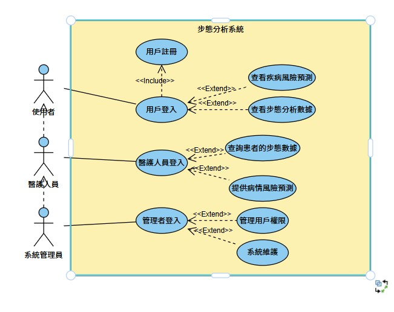

## FDD圖
```mermaid
graph TD
    A[步態分析系統]

    A --> B[用戶管理]
    A --> C[數據分析]
    A --> D[報告管理]

    B --> B1[用戶註冊]
    B --> B2[用戶登入]
    B --> B3[用戶權限管理]

    C --> C1[步態數據獲取]
    C --> C2[步態參數計算]
    C --> C3[風險預測與報告]

    D --> D1[生成步態分析報告]
    D --> D2[存取歷史報告]
    D --> D3[下載或分享報告]
```
---

## 1. 功能分解圖 (Functional Decomposition Diagram, FDD)

### 預設的功能分解圖
- **使用者管理**
  - 用戶註冊
  - 用戶登入
  - 用戶權限管理

- **數據分析**
  - 步態數據獲取
  - 步態參數計算
  - 風險預測與報告

- **報告管理**
  - 生成步態分析報告
  - 存取歷史報告
  - 報告下載或分享功能

---

## 2. 功能性需求與非功能性需求

### 功能性需求 (Functional Requirements)
1. **用戶註冊與登入功能**
   - 允許用戶註冊新帳戶，並提供登入功能以驗證用戶身分。

2. **即時步態參數分析**
   - 系統應提供即時的步態參數分析，並顯示結果供醫療人員和患者參考。

3. **病情風險預測**
   - 基於步態分析，系統提供風險預測，如肌少症、跌倒風險、平衡問題等，以支援醫療決策。

### 非功能性需求 (Non-Functional Requirements)
1. **系統可用性**
   - 系統應支援24/7可用性，確保醫療人員可隨時存取分析結果。

2. **資料隱私性**
   - 遵循醫療數據隱私法規，確保病患的個人資料與醫療資料的保密性。

3. **系統效能**
   - 即時處理步態分析，分析過程應在數秒內完成，以達成良好的用戶體驗。

---

## 3. 使用案例圖 (Use Case Diagram) 

### 使用案例圖
#### 主要角色與關係：
- **角色**
  - **用戶**：註冊與登入系統、瀏覽步態分析結果
  - **醫療人員**：查詢患者步態數據、瀏覽風險預測
  - **系統管理員**：管理用戶權限、維護數據庫
 
## 使用案例說明

### 使用案例 1：註冊與登入
- **角色**：用戶
- **前置條件**：使用者下載並啟動應用程式
- **後置條件**：系統成功驗證用戶身份並導入主頁面
- **流程**：
  1. 使用者開啟應用並選擇「註冊/登入」。
  2. 輸入基本資料並完成註冊。
  3. 用戶登入後，系統導入到首頁。

### 使用案例 2：即時步態分析
- **角色**：用戶、醫療人員
- **前置條件**：用戶成功登入，並授權分析
- **後置條件**：系統完成分析並顯示即時結果
- **流程**：
  1. 用戶選擇啟動步態分析。
  2. 系統從攝影機獲取數據並進行分析。
  3. 分析結果顯示於用戶的介面上。

### 使用案例 3：病情風險預測
- **角色**：醫療人員
- **前置條件**：已完成步態分析並獲取數據
- **後置條件**：系統提供預測結果，並將其顯示給醫療人員
- **流程**：
  1. 醫療人員查詢患者的步態數據。
  2. 系統基於數據提供病情風險預測。
  3. 醫療人員查看並評估預測報告。

